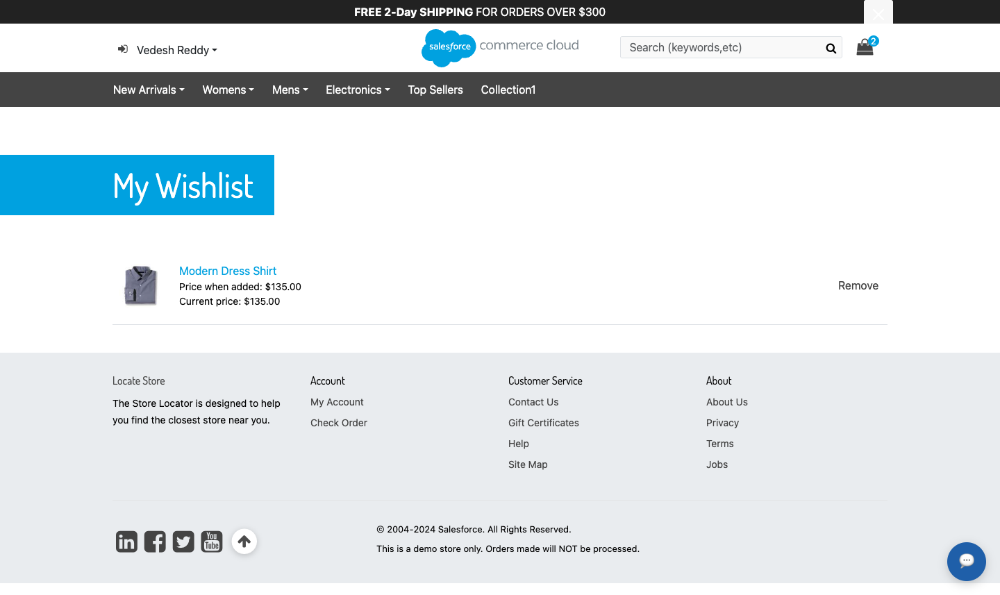

<div align="center">

# SFCC Custom Wishlist

### Save it today. Hear about it when the price drops.

A focused SFRA extension: a shopper wishlist, a scheduled price-book check, an email alert, and a popup at the next sign-in.

[](https://github.com/Vedesh-reddy/sfcc-custom-wishlist/actions/workflows/ci.yml)


[Get started](docs/INSTALLATION.md) · [Merchant guide](docs/MERCHANT-GUIDE.md) · [Code reference](docs/CODE-REFERENCE.md) · [Architecture](docs/ARCHITECTURE.md) · [Phase PRs](docs/DEVELOPMENT-PHASES.md)

</div>


> Working sandbox screenshots supplied by the author. The implementation was verified on an SFRA 8 storefront with Bootstrap 5, site `RefArch_Practice`.

## What it does

| For shoppers | For merchants | For developers |
| --- | --- | --- |
| Save the selected variant from the product page | Change prices in price books as usual | A separate `plugin_customwishlist` overlay |
| See price when added and current price | Run or schedule one job | Native `ProductList` storage, four `ProductListItem` attributes |
| Get one email listing every dropped item | Read results in the job log | No base cartridge changes; uses an empty SFRA extension point and a template hook |
| See a popup on the first page after signing in | Set the sender with `customerServiceEmail` | Explicit CSRF, ownership, and cache boundaries |

Each lower price is reported once: the next alert needs a price below the last one reported. Prices come from the applicable price books; promotions are not considered.

## Start in five steps

```sh
git clone https://github.com/Vedesh-reddy/sfcc-custom-wishlist.git
cd sfcc-custom-wishlist
npm ci
npm run validate
npm run package:metadata
```

1. **Build:** `npm run validate` runs the checks, 6 unit tests, and the asset build.
2. **Deploy:** upload `cartridges/plugin_customwishlist`, including its generated `cartridge/static` assets, into your active code version.
3. **Activate:** place `plugin_customwishlist` before `app_storefront_base` in the site's cartridge path.
4. **Import:** set your site ID in `metadata/custom-wishlist/jobs.xml`, rebuild the ZIP, and import `dist/custom-wishlist-metadata.zip` through **Administration → Site Development → Site Import & Export**.
5. **Configure:** set the `customerServiceEmail` site preference and run **Administration → Operations → Jobs → CustomWishlist-PriceDropCheck**.

```text
plugin_customwishlist:app_storefront_base:modules
```

Preserve your site's other cartridges. Import after activating the cartridge path: the job's step type is registered from `steptypes.json` in cartridges on that path. Follow the [installation guide](docs/INSTALLATION.md) for details.

## See the complete experience

### Save a product

Guests are asked to sign in. Signed-in shoppers select a size and save that variant.




<details>
<summary><strong>Guest product page</strong></summary>


</details>

### Lower the price and run the job

**Merchant Tools → Products and Catalogs → Products → 74974310M-1 → Pricing**


**Administration → Operations → Jobs → CustomWishlist-PriceDropCheck → Run Now**


### Tell the shopper


## How it fits together

```text
Product page (cached)
  └─ addToCartButtonExtension → remote include CustomWishlist-Button → Add form (CSRF)
                                                                         │
CustomWishlist-Add → customer wish list item + added price + currency ◄──┘
                                                │
Job CustomWishlist-PriceDropCheck ──────────────┤ price below baseline?
  ├─ flag item: last notified price, alert pending
  └─ one email per shopper
                                                │
Any page (cached) → afterFooter hook → remote include CustomWishlist-Alert
  └─ first page after sign-in → popup → flags cleared
```

[Read the architecture](docs/ARCHITECTURE.md).

## Repository guide

| Path | Purpose |
| --- | --- |
| [`cartridges/plugin_customwishlist`](cartridges/plugin_customwishlist) | Deployable cartridge: controller, storage service, job, hook, templates, client code, resources |
| [`metadata/custom-wishlist`](metadata/custom-wishlist) | `ProductListItem` attributes and the job definition |
| [`test/unit/plugin_customwishlist`](test/unit/plugin_customwishlist) | 6 job and price-comparison tests using platform mocks |
| [`scripts`](scripts) | Build, template check, documentation check, metadata packaging |
| [`docs`](docs) | Installation, operation, architecture, code reference, testing, troubleshooting |
| [`.github/workflows/ci.yml`](.github/workflows/ci.yml) | Validation and artifact packaging on Node 22 and 24 |

## Development commands

| Command | Result |
| --- | --- |
| `npm test` | Run the 6 unit tests |
| `npm run build` | Compile `customWishlist.js` into `cartridge/static/default/js` |
| `npm run lint` | Check JavaScript, ISML, and local documentation links |
| `npm run validate` | Run lint, tests, and build |
| `npm run package:metadata` | Produce the Business Manager import ZIP in `dist` |

The project is presented through five focused feature branches and PRs, merged in order. See [development phases](docs/DEVELOPMENT-PHASES.md).

## Scope and attribution

The cartridge covers a single wishlist per shopper, price-book price drops, email, and a post-login popup. It does not implement guest wishlists, multiple or shared lists, promotion-aware prices, back-in-stock alerts, or a My Account navigation link. The job scans every wish list on the site each run; evaluate chunking for very large customer bases.

This is an independent extension, not an official Salesforce product. See [NOTICE.md](NOTICE.md). The npm package is marked private to prevent accidental npm publication.
