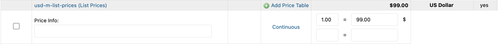
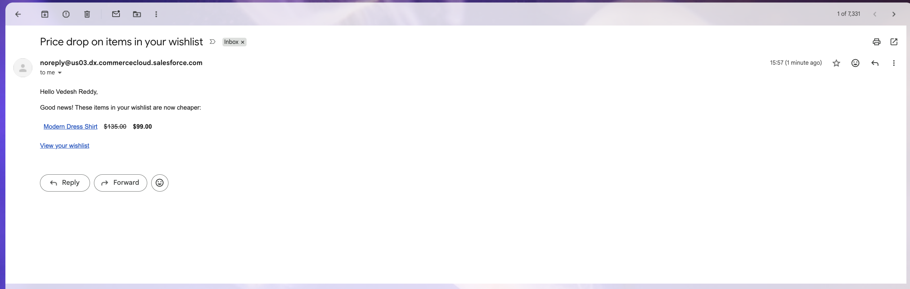
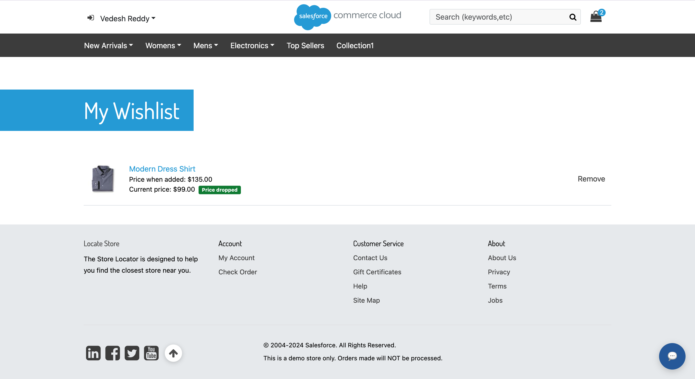

# Merchant guide

[← README](../README.md) · [Installation](INSTALLATION.md) · [Troubleshooting](TROUBLESHOOTING.md)

## What triggers an alert

The job compares each saved item's current price with a baseline:

- the **last price reported** for that item, if an alert was sent before, otherwise
- the **price when the shopper added it**.

If the current price is lower, the item is flagged, the shopper is emailed, and the new price becomes the baseline. Raising the price again does not send anything. A later drop sends an alert only if it goes below the last reported price.

The current price is the product's price from the site's applicable price books, the same one the product page shows without promotions. Promotions, coupons, and customer-group pricing do not trigger alerts. Items whose price is now in a different currency from the one saved are skipped. Offline products are skipped and hidden from the wishlist.

## Change a price

**Merchant Tools → Products and Catalogs → Products → product → Pricing**

The Pricing tab lists every price book that prices the product. Change the value in the price book the site uses and click **Apply**.

Alerts follow the product saved. Shoppers usually save a variant, so change the variant's price, or the master price if variants inherit it.

## Run the job

**Administration → Operations → Jobs → CustomWishlist-PriceDropCheck**

The imported job runs daily at 02:00 UTC on production-like instances. On sandboxes, scheduled custom jobs are disabled; click **Run Now**.

Open the log file from the history row:

| Status | Meaning |
| --- | --- |
| `OK` | Every wish list was checked. |
| `ERROR` | At least one wish list failed. Other lists were still processed. See `custom-wishlist` logs, category `price-drop-job`. |

To change the time, edit **Schedule and History** on the job.

## What the shopper sees

### Email

One email per job run lists every dropped item with the old and new price, and links to the wishlist. The sender is the `customerServiceEmail` site preference.

### Popup

On the first page after signing in, a popup lists the dropped items. It shows once per drop: the flag is cleared as soon as the popup is displayed. If the email failed, the popup still appears.

### Wishlist page

Each item shows the price when added and the current price. A **Price dropped** badge appears while the current price is below the added price.

## Where the data lives

Wishlists are the platform's customer product lists of type wish list. You can inspect them per customer through the Customer Product List APIs or OCAPI. Removing an item on the storefront deletes the item and its price history.
